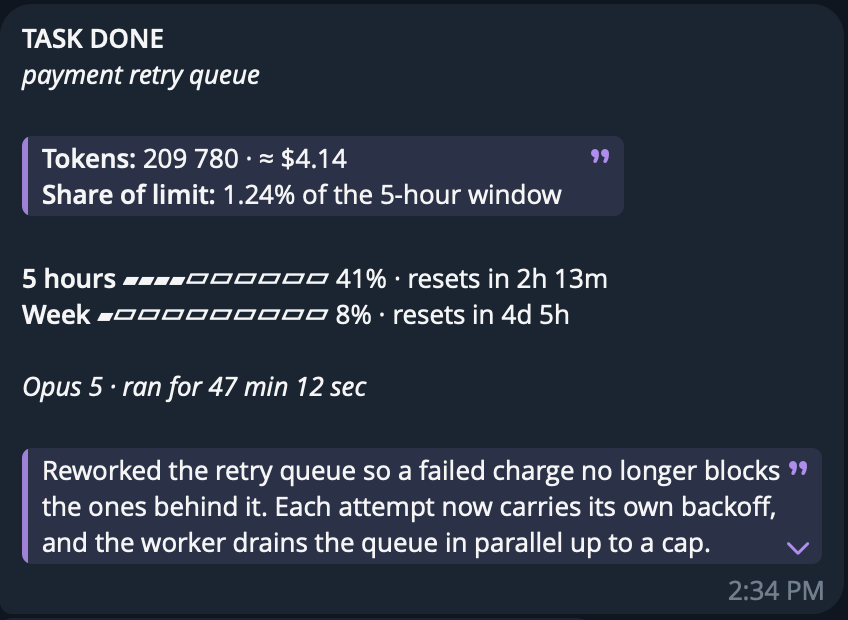
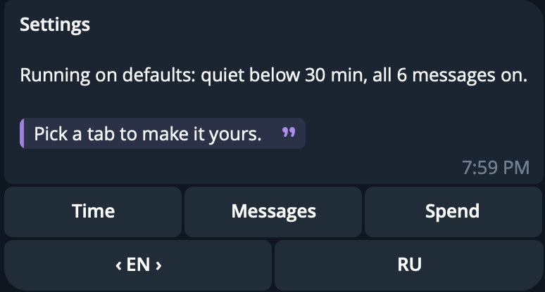
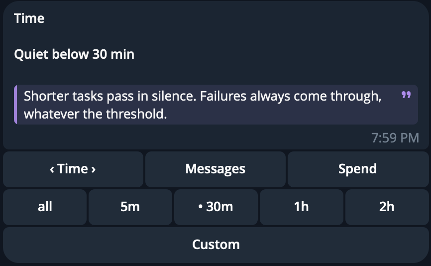
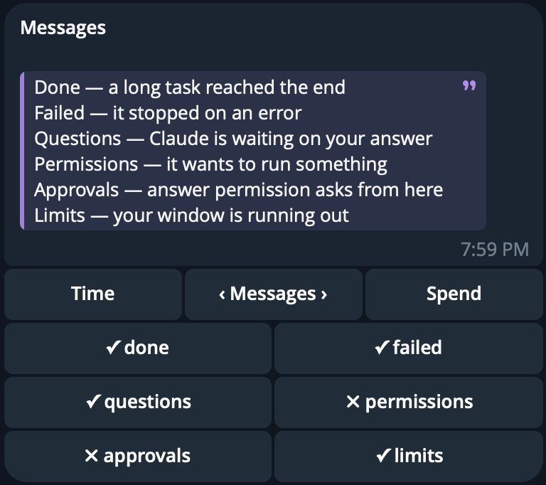
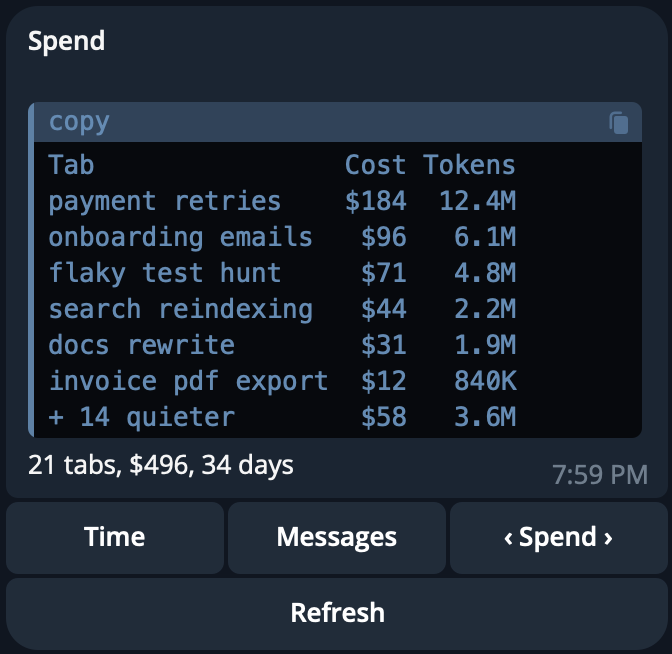
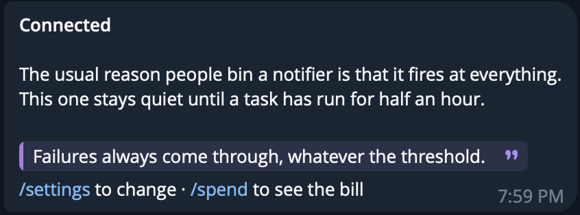
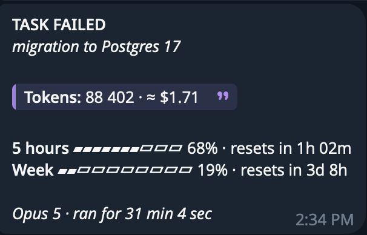
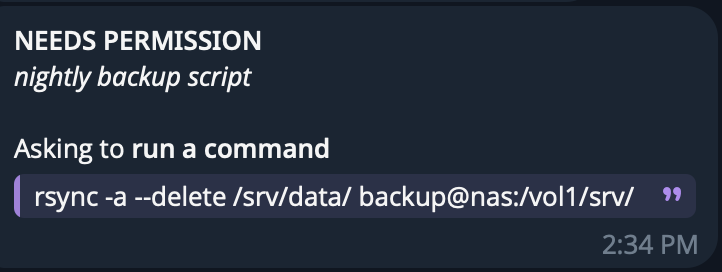
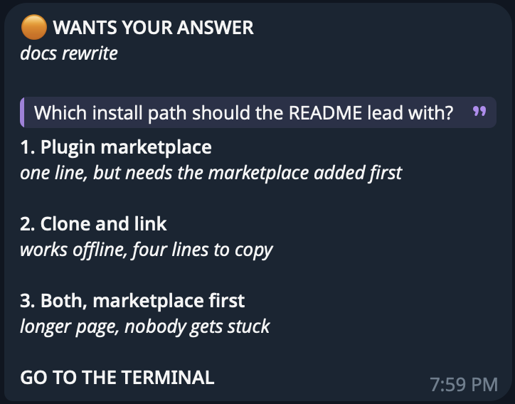
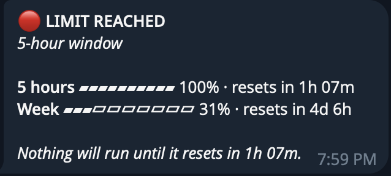

# cctab

A Telegram message when a long Claude Code task finishes, with what it cost and
how much of your rate limit it used. If you switch it on, the same chat also
gets two buttons whenever Claude Code stops to ask permission, so the session
can carry on without you at the keyboard.



You start something big, walk away, and come back to find it either finished
twenty minutes ago or stuck on a yes-or-no the whole time. cctab closes that
gap and tells you the price while it is at it.

One thing to know up front. The dollar figures are what the same tokens cost at
Anthropic's published API rates. On a subscription you are not billed per
token, so read the number as the API-equivalent cost rather than a charge. It
is still the most useful single number for comparing one tab with another.

## What makes it different

A hundred-odd projects notify you when Claude Code finishes. Several do parts of
what cctab does, and one does the headline feature:
[RichardAtCT/claude-code-telegram](https://github.com/RichardAtCT/claude-code-telegram)
(2.8k stars) appends the turn's cost to its replies. Others cover a piece each.
[echook](https://github.com/ChanMeng666/echook) reports rate-limit headroom and
holds back on short tasks. [ccgram](https://github.com/jsayubi/ccgram) does
limits and approval buttons. [tg-claude-bot](https://github.com/xhyumiracle/tg-claude-bot)
does usage bars and settings from the phone.
[Lucarne](https://github.com/tuchg/Lucarne) and
[claude-ntfy-hook](https://github.com/nickknissen/claude-ntfy-hook) do approvals.
Anthropic's own [Channels](https://code.claude.com/docs/en/channels) relays
permission prompts to Telegram and Discord.

What I could not find anywhere is all of it in one hook: money, limit headroom,
per-tab spend, a quiet threshold, approval buttons, and settings you change from
the phone, with no server, no MCP process and nothing to install beyond Python.

| | cctab | Official Telegram channel |
|---|---|---|
| Says a long task finished | yes | no, it answers you in chat |
| Dollars spent, unprompted | yes | no |
| Rate limit left | yes | no |
| What each tab cost | yes | no |
| Silent on short tasks | yes | n/a |
| Settings from your phone | yes | no |
| Approve a tool from your phone | yes, two buttons | yes, by typing a reply code |
| What it takes to run | a hook | Bun, an MCP server, `--channels` |

Cost is the awkward one to build, which is why most projects skip it. Claude Code
does not hand cost to hooks
([#11008](https://github.com/anthropics/claude-code/issues/11008)), so it has to
be worked out from the session transcripts, per request, per model.

The official Telegram channel is a chat bridge that can also
[relay permission prompts](https://code.claude.com/docs/en/channels-reference#relay-permission-prompts).
It is in research preview, runs an MCP server on Bun, and you answer by typing
`yes` with a five-character request id. cctab is a plain hook with two buttons.
They do not fight. Run both if you want the chat as well.

## Quiet by default

The reason most people uninstall a notifier is that it fires on everything. Out
of the box cctab says nothing until a task has run for thirty minutes. Failures
always come through, whatever the threshold.





Send `/settings` to your bot and change it from wherever you are. One message,
three tabs: how long a task must run before it counts, which messages reach you,
and what every tab of yours has cost. It rewrites itself in place, so the chat
does not fill up with old menus. There is no config file to edit and nothing to
restart.

`/spend` opens the third tab on its own. It reads the session transcripts, takes
the tab names Claude Code already wrote there, and prices every one of them.



## Install

```
/plugin marketplace add drasezv/cctab
/plugin install cctab
```

Then ask Claude to set up cctab. It walks you through the rest: a bot username
nobody has taken yet, the three lines to send @BotFather, and where to paste the
token. Press Start in the chat and you are connected. About forty seconds.

The token is saved to `~/.cctab/config.json`, readable only by your user. To
keep it in the system keychain instead, paste it into the plugin's `bot_token`
setting afterwards.

Claude Code reads its hooks at startup. If you install inside a running session,
restart it once, or the permission buttons will not fire.

## What it looks like

The first thing it ever says, once the bot knows where to find you:



A task that fell over, with the error it died on rather than the answer it never
reached:



Something waiting on you, with the command it wants to run. Tap and the session
carries on without you:



A question it cannot answer from here, and says so:



And the moment a window runs out, said once:



## Where the rate limits come from

Claude Code hands rate limits to the statusline command and nowhere else, so a
hook cannot see them. cctab takes them in this order:

1. **A statusline wrapper.** Official numbers, no network, no tokens. Ask Claude
   to wire it, or run the helper yourself from the plugin folder:

   ```
   scripts/setup.py --statusline
   ```

   It takes the statusline slot, remembers whatever statusline you already ran,
   and hands the payload straight on to it. Your own statusline keeps working.

2. **The usage endpoint**, off unless you turn on `use_usage_api`. It reads your
   local OAuth token and calls an endpoint Anthropic has not documented, which
   is why it is opt-in.

   You need this one if you work in the VS Code extension. There is no statusline
   there, so Claude Code never runs the wrapper.

3. **Nothing.** The message still carries what the task cost.

Cost never depends on any of this. It comes from the session transcript,
deduplicated per request and priced per model.

## Settings

| Option | Default | What it does |
|---|---|---|
| `bot_token` | none | From @BotFather. Lives in `~/.cctab/config.json` unless you move it to the keychain |
| `chat_id` | auto | Captured the first time you message the bot |
| `min_seconds` | 1800 | Starting quiet threshold. Change it from the phone later |
| `statusline_command` | none | Your existing statusline, run untouched after ours |
| `use_usage_api` | off | Fall back to the undocumented usage endpoint |
| `name_tasks` | off | Label each push using Haiku. Costs you one small call per session |

## Approvals, and their limits

Approvals are off until you switch them on: `/settings`, then Messages, then
`approvals`. Once on, whenever Claude Code needs permission, cctab puts the ask
in front of you with the tool, the actual command, and two buttons. Tap one and
the session carries on.

While it waits for your tap, Claude Code waits too. The hook holds the session
for up to a minute, then the prompt goes to the terminal exactly as it would
have. That pause is the reason the feature is off by default: it should be a
choice, not a surprise.

What it will never do is take dictation. Nothing can be typed into a session
from the phone. The only thing that travels back is a yes or a no to something
Claude Code asked first, and a tap only counts if it comes from your own chat.
A stolen chat cannot compose its own command, but it can approve one, so treat
the chat the way you treat the machine.

Questions are different. A hook can answer yes or no and nothing else, so when
Claude asks you to choose between options, cctab can only tell you it is
waiting. There is nowhere to put the answer. Those messages say GO TO THE
TERMINAL, and mean it.

## What leaves your machine

Only the messages, and only to your bot. There is no server in the middle. A
message can carry the tab name, the closing lines of Claude's answer (about 700
characters at most), the text of an error, the command Claude wants to run, and
on `/spend` the names of your tabs across every project. Anything that looks
like a key, token or password inside a command is blanked before sending.

Telegram bot chats are not end-to-end encrypted, which is one more reason to
keep the approval buttons off unless you want them.

Two optional settings reach outside on their own. `name_tasks` sends the opening
of a session to Haiku to give the push a title. `use_usage_api` reads the OAuth
token Claude Code keeps in your keychain or credentials file and asks Anthropic
for your rate limits.

## Uninstall

```
/plugin uninstall cctab
```

Then delete `~/.cctab`; it holds the bot token. If you wired the statusline,
put your old command back under `statusLine` in `~/.claude/settings.json`. It
is saved in `~/.cctab/config.json` as `statusline_command`.

## Requirements

Python 3.8 or newer, nothing else. Tested on 3.9 and 3.10. The permission
buttons need a Claude Code with the `PermissionRequest` hook.

## License

MIT

Made by [Drasezv](https://github.com/drasezv).
